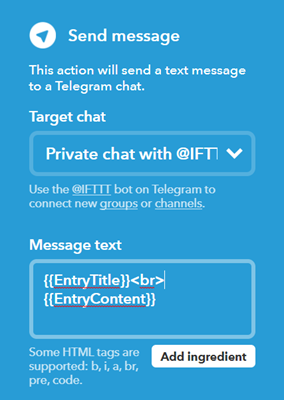

# Welcome to BotBittrex's GitHub Website

### Türkçe devam etmek istiyorsanız, [burayı tıklayınız](TURKISH.md). 
### What is the BotBittrex?
BotBittrex is a PHP-RSS bot script that written for Cryptocurrencies. It basically sends you notifications about your Open Orders, Profits, Altcoins' Informations and It can make trade on behalf of you in Bittrex Exchange. Thanks to BotBittrex's unique algorithm, it can calculate and notify you about possible upward altcoins price changes, It can BUY/SELL these coins on behalf of you in Bittrex Exchange, If you Bittrex Exchange order completed, It can send notifications via Telegram (or email) or If you made a profit after bought an altcoin, It can send notifications via Telegram (or email). There are there type of subscription available on BotBittrex.

BotBittrex will **NEVER** send you BUY/SELL signal. There are millions of Telegram groups for that. To be honest, in this type of volotile markets nobody can tell you to the future precisely and nobody can give you guarantee for making money. As you know lots of **WHALE** groups exists in crytocurrency market and most of them try to you buy their coins. If the human involves the system always getting worse and open for manipulations. BotBittrex is a software. It follows his tasks and calculations. Nobody can change its way. On all of BotBittrex subscriptions, BUY/SELL decisions will made by you except BotBittrex Pro subscription.

### What type of BotBitrex subscriptions available and what's the differences?
There three type of subscriptions available for BotBittrex:
1. BotBittrex Free
2. BotBittrex Lite
3. BotBittrex Pro (Developing)

### BotBittrex Free:
You can  BotBittrex on Twitter and be aware of the coins that choosen by its algorithm on every three hours. Every three hours BotBittrex tweets 0-5 altcoins with last price **(Price)**, last one hour change **(1H)**, last 24 hour change **(24H)** and last 7 days change **(7D)** informations. **DO NOT FORGET, BotBittrex will never make investment advices. Making investment for these altcoins in your responsiblity.** BotBittrex does not makes deep technical analyze. Just checks certain criterions like (Volume, Market Cap, Changes etc.) and picks the best coins. As you know thousands of altcoins available and checking all of them one by one takes days for humans but BotBittrex can handle this job in couple of seconds. BotBittrex **WILL NOT** choose **PoS (Proof of Stake)** type of altcoins.

BotBittrex Free hizmetinden yararlanmak için lütfen  takip ediniz.

### BotBittrex Lite:
BotBittrex Lite, Bittrex API kullanarak mevcut emirlerinizin durumunu 15 dakikada bir kontrol eder ve açık emirlerinizin gerçekleşmesi durumunda aşağıdakine benzer Telegram mesajları (ya da email) gönderir.

Buna ek olarak elinizdeki altcoinlerin son fiyat bilgilerini 15 dakikada bir kontrol ederek, kara geçtiğinizde size Telegram (ya da email) ile bilgilendirme mesajları gönderir.

BotBittrex Free, size üç saatte bir twitter hesabımız  üzerinden altcoin önerirken, BotBittrex Lite ile Telegram kanalımıza katılarak 15 dakikada bir algoritmanın önerdiği altcoinlerden haberdar olabilirsiniz.

### BotBittrex Lite'a nasıl üye olabilirim ve neler gereklidir?

BotBittrex Lite aylık abonelikle yaralanabileceğiniz bir servis olup, aylık **0.01 BTC** ücret karşılığında bu servisten yararlanabilirsiniz. Ödemeniz ulaşır ulaşmaz aboneliğiniz başlar ve aboneliğiniz yenilenmediği takdirde 30 gün sonra sistem tarafından aboneliğiniz iptal edilir. Ödemenizi aşağıdaki Bitcoin adresine gönderdikten sonra TX bilgisini  adresine göndermeniz gerekmektedir. 

**BTC Adresimiz:**
### 1LaZG8XELxs9JCzzVJaWyhxQG6tCcswJnx

BotBittrex Lite hizmeti size karlılık ve gerçekleşen son 10 ALIŞ/SATIŞ emirlerinizin bilgilerini içeren bir RSS feed hizmeti sunar. Ücretsiz IFTTT.com servisini kullanarak Telegram, Email, Twitter, Facebook vb üzerinden bildirim alabilirsiniz. Lite üyelikte size özel bir URL vereceğiz. O adres sizin 15 dakikada bir güncellenen RSS Feed adresiniz olacak. Herhangi bir hosting, teknik bilgi-beceri gerektirmiyor. Ücretsiz bir IFTTT.com üyeliği yeterli olacaktır. Yaygın olarak **RSS->IFTTT.com->Telegram** dönüşümü kullanılmaktadır.

Bittrex Borsasına üye değilseniz burayada üye olmanız gerekiyor. Bittrex üyeliğiniz olduktan sonra 2FA'yı açıp (iki aşamalı güvenlik) API bölümünden aşağıdaki şekilde görüldüğü gibi bir API key oluşturup o keye **SADECE READ INFO** izni verip, key ve secretı  ile bize ulaştırmanız gerekmektedir. Sadece **READ INFO** izni Lite abonelik için yeterli olup, ne bize ne de başkasına kesinlikle **WITHDRAW** izni vermeyiniz! **WITHDRAW** izni verdiğiniz API kullanıcıları tüm paranızı çekebilir. Bu yüzden kimseye **WITHDRAW** izni vermeyiniz.

 
Üyelerimize özel Telegram grubumuza katılmak için Telegram kullanıcısı olmanız gerekiyor. BotBittrex Lite hizmetini denemek istiyorsanız **ÜCRETSİZ 7 GÜNLÜK** BotBittrex Lite hizmeti için aşağıdaki bilgileri  adresine göndermeniz yeterlidir.

* API Key ve Secret
* Telegram kullanıcı adınız
* Twitter kullanıcı adınız (varsa)

BotBittrex Lite hizmetinden memnun kaldıysanız ve aylık abone olmak istiyorsanız yukarıdaki bilgilere ilave olarak:

* 0.01 BTC gönderdiğinize dair işlemin TX bilgisi

### BotBittrex Pro:

Bu abonelik türü geliştirilme ve test aşamasındadır.

## Sıkça Sorulan Sorular:

### Neden açık kaynak kodlu değil?

BotBittrex yaklaşık 1.5 aylık bir çalışmanın sonucunda ortaya çıktı. Kripto para üzerine birçok kişi ya da kişiler Telegram üzerinden gruplar kurarak ne kadar finans bilgileri olduğu bile bilinmezken birçok kişiden bizim abonelik ücretimizin 10-15 katı ücretler talep etmekteler. Bunların birçoğu aynı sinyalleri birbirlerinden alıp paylaşmaktalar. BotBittrex ise bir algoritma çerçevisinde size önerilerde bulunur ayrıca sadece öneride bulunmakla kalmayıp, mevcut açık emirleriniz gerçekleştiğinde ya da kara geçtiğinizde size yukardaki gibi uyarılar gönderir. Bu emeğin bir karşılığı var. Açık kaynak kodlu olarak sunmayı isterdik ancak birçok **UYANIK** bu kodu alıp emek hırsızlığı yaparak bundan rant elde edecekti. Bu yüzden BotBittrex açık kaynak kodlu değildir.

### Lite/Pro üyesi oldum ama sistemden hoşnut kalmadım para iadesi yapıyor musunuz?

Ücretsiz deneme hizmeti sunduğumuzdan herhangi bir para iadesi yapmıyoruz.

### Size Bittrex API Key ve Secretımı verirsem BTC'lerimi çalabilir misiniz?

**WITHDRAW** yetkisi vermediğiniz sürece sizin birikimlerinizi Bittrex dışına ne biz ne de başkası API yoluyla çıkarabilir. Bu konuda içiniz rahat olsun. Lite abonelik için Read INFO yetkisi yeterliyken Pro üyelik için Trade Market yetkiside gerekmektedir.

### IFTTT.com üzerinden bana verdiğiniz RSS Feed adresini nasıl ekleyip Telegram'dan mesajlar alacağım?

IFTTT.com'a üye olduktan sonra servisler kısmında RSS ve Telegram'ı bulup ekleyin. New Applet düğmesine tıklayarak önce RSS servisini seçin. Sonra New Feed Item'ı seçip ilerleyin. Sonraki aşamada size üye olduktan sonra göndereceğimiz RSS adresini giriniz. Sonraki aşamada Telegram'ı seçip ilerledikten sonra New Private message'ı seçin. Message text yazan kutuya aşağıdaki

doldurmanız yeterli olacaktır. Çok yakında bu konuyla ilgili bir videoyu sizinle paylaşacağız.

### RSS Feed adresim nasıl olacak?

RSS Feed adresiniz http://server_adresi/**rsskullanıcıadı** veya **kullanıcıadırss**'dir. İkisinide kullanabilirsiniz.

### Size verdiğimiz API bilgilerimizin güvenliğini nasıl sağlıyorsunuz?

API bilgileriniz başka bir sunucuda SHA512 algoritmasıyla şifrelenmektedir. Veritabanımız 7/24 güvenliği yüksek Türkiye'de ticari sunucularda saklanmaktadır. Bu veritabanı çalınsa dahi API bilgileriniz yüksek düzeyde şifrelendiğinden kullanılamaz halde olacaktır.

### Desteğe ihtiyacım olduğunda size nasıl ulaşabilirim?

Sadece üyeliğinizle ilgili sorunlarınız için email ve twitter hesabımızdan bize ulaşabilirsiniz. Teknik konularda sorularınızı **SADECE** [Issues](https://github.com/botbittrex/botbittrex.github.io/issues) linkinden  sorabilirsiniz. Ayrıca [Wiki](https://github.com/botbittrex/botbittrex.github.io/wiki) sayfalarımızıda okuyarak pek çok sorunun çözümüne kendiniz ulaşabilirsiniz. Email adresimiz :  ve Twitter adresimiz : 
