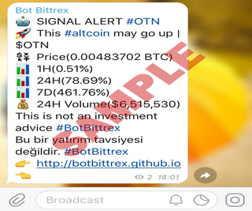
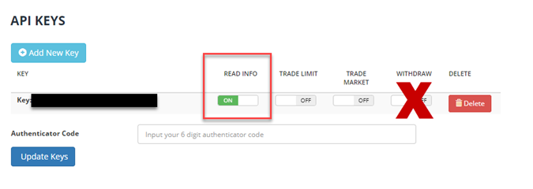

# BotBittrex'in GitHub Websitesine Hoşgeldiniz

### [Click here](README.md) to continue in English. 
### BotBittrex Nedir?
BotBittrex, kripto para birimleri için yazılmış PHP ve RSS tabanlı birçok bölümden oluşan bir Bilgilendirme/ALIŞ-SATIŞ botudur. BotBittrex, kendi algoritması aracılığıyla fiyatının yükselme ihtimali olan altcoinlerden sizi haberdar edebilir, bu altcoinlerden sizin adınıza Bittrex Borsası üzerinden otomatik ALIŞ/SATIŞ yapabilir, yine Bittrex Borsası üzerinden ALIŞ/SATIŞ emirlerinizin gerçekleşmesi durumunda Telegram yoluyla (ya da email ile) size bilgi mesajı gönderebilir ya da almış olduğunuz bir altcoinden kara geçmeye başladığınızda yine Telegram üzerinden (ya da email ile) size bilgilendirme mesajı gönderen ve farklı abonelik tipleri olan bir servistir.

Telegram'da bulunan birçok sinyal grubunun aksine BotBittrex size **ASLA** ALIŞ/SATIŞ sinyali vermez. Bu kadar volatil bir pazarda size kazandırma sözü veren kişi ya da gruplara itibar etmemenizi tavsiye ederiz. **BALİNA** diye tabir edilen bazı grupların sizlere ellerinde kalan altcoinleri aldırmaya çalıştığını ve işin içine insan girdiğinde hertürlü manipülasyona açık bir sistemin oluştuğunu unutmayın. BotBittrex bir yazılımdır. Kendisine öğretilmiş kriterlere göre işlem yapar. Dışardan insan müdehalesi söz konusu değildir. BotBittrex Pro aboneliği hariç tüm verisyonlarında ALIŞ/SATIŞ kararı tamamen size aittir.

### BotBitrex'in abonelik tipleri ve farkları nelerdir?
BotBittrex'in üç farklı abonelik türü bulunmaktadır:
1. BotBittrex Free
2. BotBittrex Lite
3. BotBittrex Pro (Geliştiriliyor)

### BotBittrex Free:
BotBittrex'in  hesabını takip ederek, algoritmasının belirlediği altcoinlerden ücretsiz olarak her üç saatte bir haberdar olabilirsiniz. Her üç saatte bir 0-5 adet seçilmiş altcoinin mevcut fiyat bilgisini **(Price)**, son bir saat içindeki değişimini **(1H)**, son 24 saat içindeki değişimini **(24H)** ve son bir hafta içersindeki değişimini **(7D)** görebilirsiniz. **Unutmayın BOTun önerdiği altcoinlerin size para kazandırma garantisi yoktur. Seçtiği altcoinlere yatırım yapmak kullanıcının sorumluluğundadır.** Derin bir teknik analiz yapmadan sadece belli kriterlere sahip (Hacim, Pazar Payı, Değişim vs.) altcoinleri seçerek size sunar. Binlerce altcoinin olduğu bu pazarda bu incelemeyi biz insanların tek tek altcoinlere bakarak yapması çok uzun zaman alırken, BOT bunu saniyeler içersinde yapmaktadır. BotBittrex, proof tipi **PoS (Proof of Stake)** olan altcoinleri **SEÇMEZ.**

BotBittrex Free hizmetinden yararlanmak için lütfen  takip ediniz.

### BotBittrex Lite:
BotBittrex Lite, Bittrex API kullanarak mevcut emirlerinizin durumunu 15 dakikada bir kontrol eder ve açık emirlerinizin gerçekleşmesi durumunda aşağıdakine benzer Telegram mesajları (ya da email) gönderir.

Buna ek olarak elinizdeki altcoinlerin son fiyat bilgilerini 15 dakikada bir kontrol ederek, kara geçtiğinizde size Telegram (ya da email) ile bilgilendirme mesajları gönderir.

BotBittrex Free, size üç saatte bir twitter hesabımız  üzerinden altcoin önerirken, BotBittrex Lite ile Telegram kanalımıza katılarak 15 dakikada bir algoritmanın önerdiği altcoinlerden haberdar olabilirsiniz.

### BotBittrex Lite'a nasıl üye olabilirim ve neler gereklidir?

BotBittrex Lite aylık abonelikle yaralanabileceğiniz bir servis olup, aylık **0.01 BTC** ücret karşılığında bu servisten yararlanabilirsiniz. Ödemeniz ulaşır ulaşmaz aboneliğiniz başlar ve aboneliğiniz yenilenmediği takdirde 30 gün sonra sistem tarafından aboneliğiniz iptal edilir. Ödemenizi aşağıdaki Bitcoin adresine gönderdikten sonra TX bilgisini  adresine göndermeniz gerekiyor. 

**BTC Adresimiz:**
### 1LaZG8XELxs9JCzzVJaWyhxQG6tCcswJnx

BotBittrex Lite hizmeti size karlılık ve son 10 ALIŞ/SATIŞ emrinizin gerçekleşmesi bilgilerini içeren bir RSS feed hizmeti sunar. ücretsiz IFTTT.com servisini kullanarak Telegram, Email, Twitter, Facebook vb üzerinden bildirim alabilirsiniz. Lite üyelikte size özel bir URL vereceğiz. O adres sizin 15 dakikada bir güncellenen RSS Feed adresiniz olacak. Herhangi bir hosting, teknik bilgi-beceri gerektirmiyor. Ücretsiz bir IFTTT.com üyeliği yeterli olacaktır. Yaygın olarak **RSS->IFTTT.com->Telegram** dönüşümü kullanılmaktadır.

Bittrex Borsasına üye değilseniz burayada üye olmanız gerekiyor. Bittrex için bu BOT yazıldı. Bittrex üyeliğiniz olduktan sonra 2FA'yı açıp (iki aşamalı güvenlik) API bölümünden aşağıdaki şekilde görüldüğü gibi bir API key oluşturup o keye **SADECE READ INFO** izni verip, key ve secretı  üzerinden DM ile ulaştırmanız gerekmektedir. Sadece **READ INFO** izni Lite abonelik için yeterli olup, ne bize ne de başkasına kesinlikle **WITHDRAW** izni vermeyiniz! **WITHDRAW** izni verdiğiniz API kullanıcıları tüm paranızı çekebilir. Bu yüzden kimseye **WITHDRAW** izni vermeyiniz.

 
Üyelerimize özel Telegram grubumuza katılmak için Telegram kullanıcısı olmanız gerekiyor. BotBittrex Lite hizmetini denemek istiyorsanız **ÜCRETSİZ 7 GÜNLÜK** BotBittrex Lite hizmeti için aşağıdaki bilgileri  adresine göndermeniz yeterlidir.

* API Key ve Secret
* Telegram kullanıcı adınız
* Twitter kullanıcı adınız

BotBittrex Lite hizmetinden memnun kaldıysanız ve aylık abone olmak istiyorsanız yukarıdaki bilgilere ilave olarak:

* 0.01 BTC gönderdiğinize ait işleme ait TX bilgisi

### BotBittrex Pro:

Bu abonelik türü geliştirilme ve test aşamasındadır.

## Sıkça Sorulan Sorular:

### Neden açık kaynak kodlu değil?

BotBittrex yaklaşık 1.5 aylık bir çalışmanın sonucunda ortaya çıktı. Kripto para üzerine birçok kişi ya da kişiler Telegram üzerinden gruplar kurarak ne kadar finans bilgileri olduğu bile bilinmezken birçok kişiden bizim abonelik ücretimizin 10-15 katı ücretler talep etmekteler. Bunların birçoğu aynı sinyalleri birbirlerinden alıp paylaşmaktalar. BotBittrex ise bir algoritma çerçevisinde size önerilerde bulunur ayrıca sadece öneride bulunmakla kalmaz ve mevcut açık emirleriniz gerçekleştiğinde ya da kara geçtiğinizde size yukardaki gibi uyarılar gönderir. Bu emeğin bir karşılığı var. Açık kaynak kodlu olarak sunmayı isterdik ancak birçok **UYANIK** bu kodu alıp emek hırsızlığı yaparak bundan rant elde edecekti. Bu yüzden BotBittrex açık kaynak kodlu değildir.

### Lite/Pro üyesi oldum ama sistemden hoşnut kalmadım para iadesi yapıyor musunuz?

Ücretsiz deneme hizmeti sunduğumuzdan herhangi bir para iadesi yapmıyoruz.

### Size Bittrex API Key ve Secretımı verirsem BTC'lerimi çalabilir misiniz?

**WITHDRAW** yetkisi vermediğiniz sürece sizin birikimlerinizi Bittrex dışına ne biz ne de başkası API yoluyla çıkaraiblir. Bu konuda içiniz rahat olsun. Lite abonelik için Read INFO yetkisi yeterliyken Pro üyelik için Trade Market yetkiside gerekmektedir.

### Desteğe ihtiyacım olduğunda size nasıl ulaşabilirim?

Bize her zaman twitter adresimiz ve email adresimizden ulaşabilirsiniz.

### IFTTT.com üzerinden bana verdiğiniz RSS Feed adresini nasıl ekleyip Telegram'dan mesajlar alacağım?

IFTTT.com'a üye olduktan sonra servisler kısmında RSS ve Telegram'ı bulup ekleyin. New Applet düğmesine tıklayarak önce RSS servisini seçin. Sonra New Feed Item'ı seçip ilerleyin. Sonraki aşamada size üye olduktan sonra göndereceğimiz RSS adresini giriniz. Sonraki aşamada Telegram'ı seçip ilerledikten sonra New Private message'ı seçin. Message Text yazan kutuya 


    {{EntryTitle}} {{EntryContent}}


yazmanız yeterli olacaktır. Çok yakında bu konuda bir videoyuda sizinle paylaşacağız.

### RSS Feed adresim nasıl olacak?

RSS Feed adresiniz http://server_adresi/**rsskullanıcıadı** veya **kullanıcıadırss**'dir. İkisinide kullanabilirsiniz.

### Size nasıl ulaşabilirim?

Email adresimiz :  ve Twitter adresimiz : 
